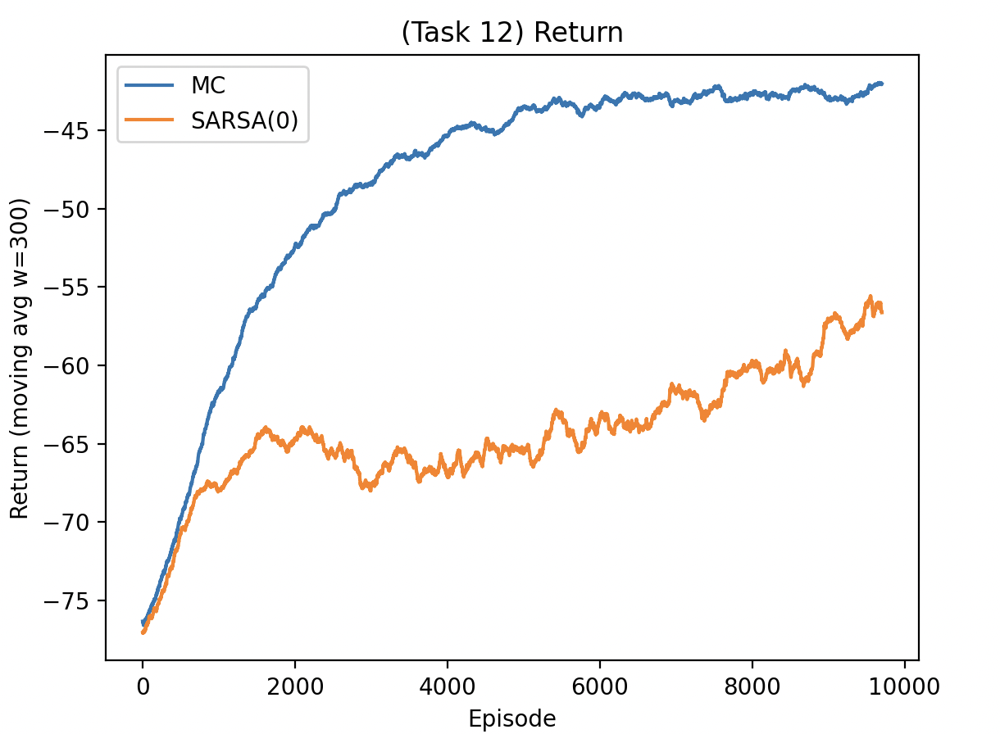
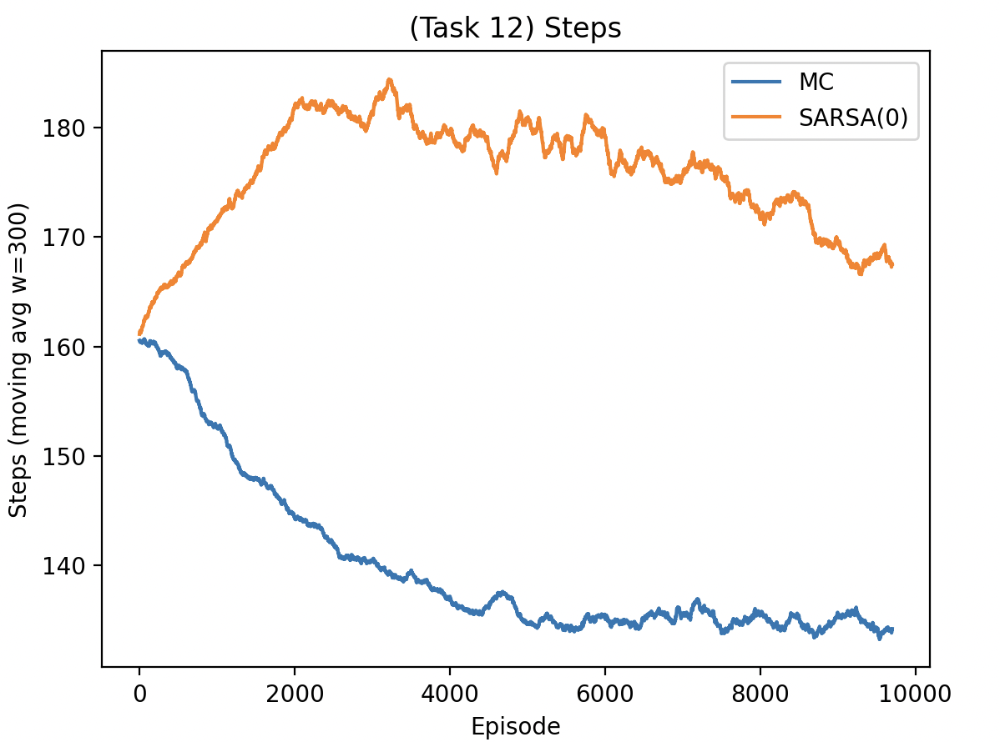
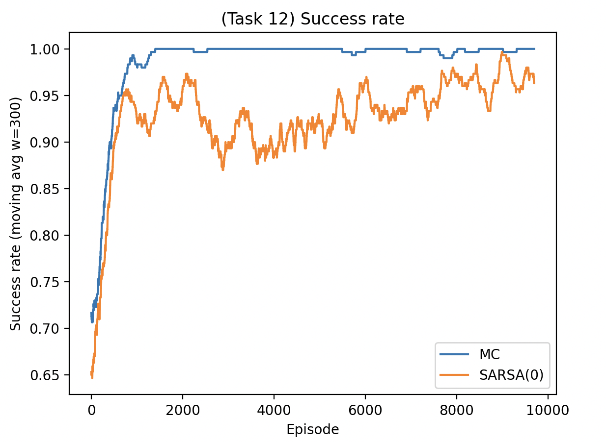
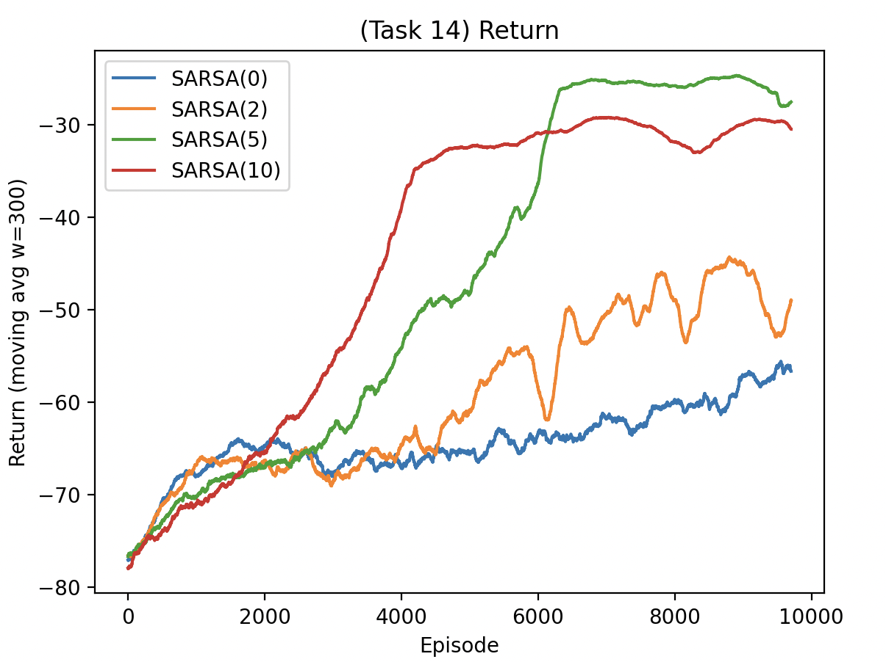
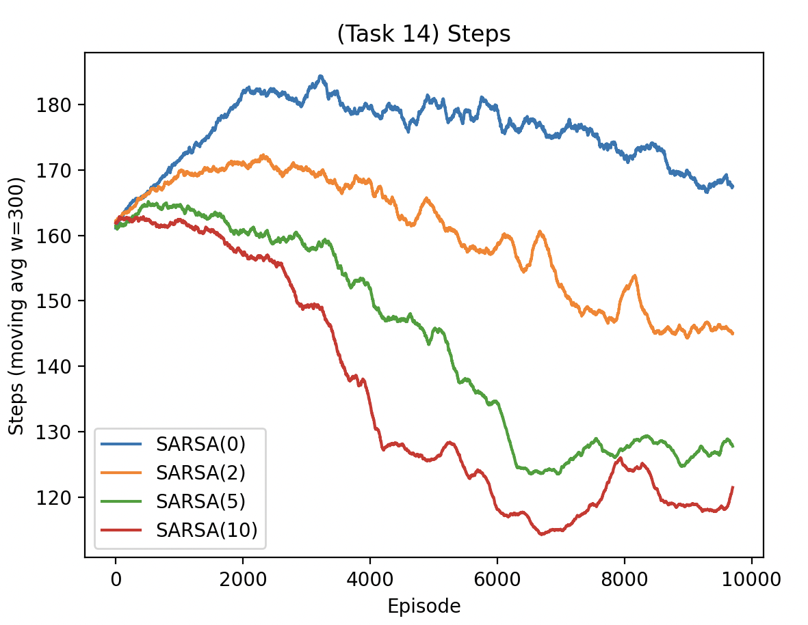
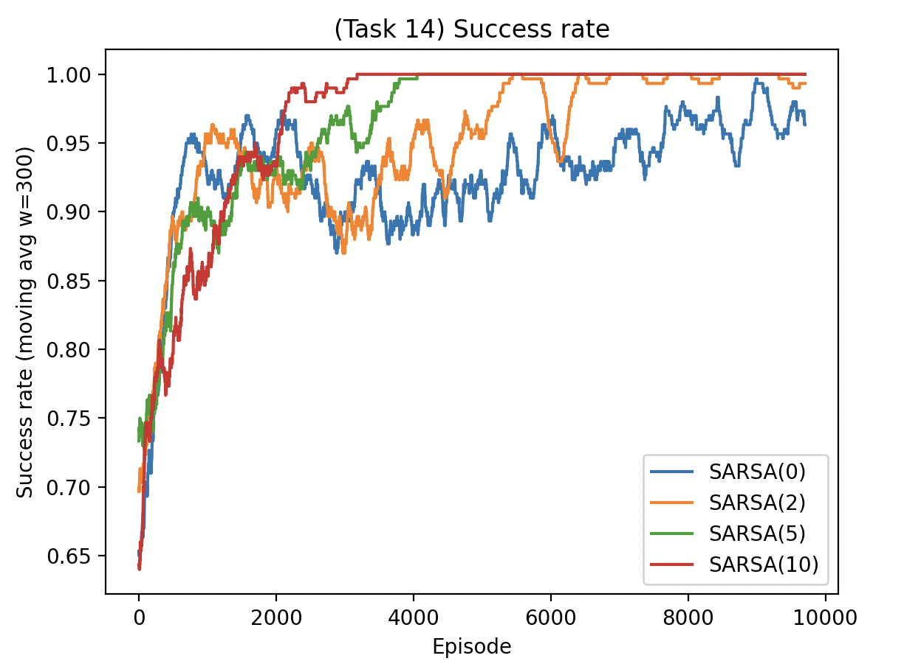
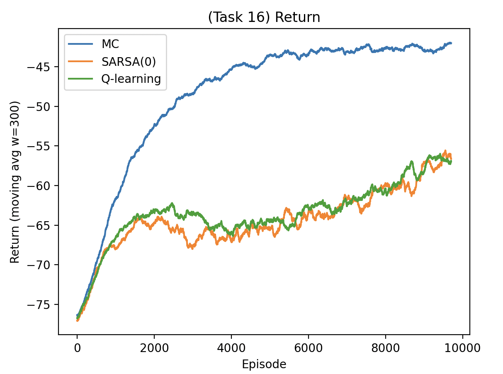
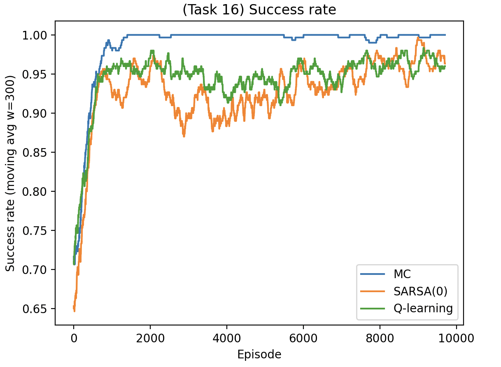

## Problem set 3: Report

#### 5.4 MC Improvement

SpaceY provided 1000 finite-horizon trajectories collected under an unknown fixed policy $\pi$. Each transition is $(s_t,a_t,r_t,s_{t+1})$. I applied **first-visit Monte Carlo** ($\gamma=1$) to estimate:

- $v_\pi(s)$ by averaging observed returns from first visits of each state.
- $q_\pi(s,a)$ by averaging observed returns from first visits of each $(s,a)$.

- The learned values covered 2924 states and 14138 state action pairs (v1 action set size 5).

A greedy “improved” policy was formed by selecting, for each visited state, the action with the highest estimated $\hat q_\pi(s,a)$ among actions actually observed in the dataset. This produced a policy defined on all 2924 visited states. 

However, coverage was uneven: average observed actions per state was ≈4.84 (min 1, max 5), and 606/2924 greedy choices were based on fewer than 5 samples for the selected $(s,a)$. Consequently, the improvement is only as good as the dataset’s support and suffers from high variance in rarely visited state–action pairs. Because the dataset restricts which actions are ever seen and because estimates are noisy (finite sampling, stochastic dynamics), the greedy policy cannot be claimed optimal only “best w.r.t. the estimated $q_\pi$” on the data support.

#### 5.5 Are all trajectories equally useful?

No, trajectory usefulness differed substantially. Trajectories contribute information about good routes and broaden coverage when they:
- reach the goal 
- visit diverse regions 
- include many distinct $(s, a)$ pairs (reduces variance)

Trajectories dominated by early termination (timeouts) or repeatedly visiting the same region mainly reinforce already-sampled behavior and contribute little new information. With first-visit updates, looping within an episode contributes less than with every visit, which helps prevent over-weighting repetitive segments.

#### 5.7 Starting policy
Using the simulator (**v1**), we trained tabular control methods with ε greedy exploration (decaying ε with a small floor) to ensure early exploration and later exploitation. This starting policy is appropriate in a mostly negative reward setting: purely greedy behavior from an untrained table tends to get stuck, while ε-greedy guarantees continual discovery of alternative routes.

#### Experiment setup
For all control comparisons, I tracked three episode-level metrics and plotted their moving averages ($w=300$):

1) **Return** (sum of rewards; less negative is better),  
2) **Steps** (episode length; fewer steps indicates a faster route),  
3) **Success rate** (fraction of evaluation episodes reaching the goal).

Empirically, control succeeded: policies learned by episode based MC control and by TD control consistently achieved high goal-reaching success. In particular, evaluation of greedy policies after training on v1 (300 evaluation episodes) gave:

- **MC control:** return -42.268, steps 134.58, success 0.990  
- **SARSA(0):** return -70.959, steps 258.32, success 0.803  
- **SARSA(2):** return -43.184, steps 143.14, success 0.987  
- **SARSA(5):** return -23.906, steps 118.73, success 1.000  
- **SARSA(10):** return -31.559, steps 137.24, success 1.000  
- **Q-learning:** return -139.661, steps 156.74, success 0.047  

### MC vs SARSA(0)
The figures below compare MC control and SARSA(0) over training episodes (moving avg $w=300$).

**Return**

**Steps**

**Success rate**

### SARSA(0) vs SARSA(n)

I compared SARSA(0) with SARSA(n) for $n \in \{2,5,10\}$.

**Return**

**Steps**

**Success rate**

These results show that SARSA with multi-step targets improved dramatically over SARSA(0), with \(n=5\) performing best in this run (highest return, lowest steps, perfect success). Compared to MC control, SARSA(5) achieved a shorter and higher-quality route, consistent with the advantage of mixing bootstrapping and multi-step returns. Q-learning performed poorly here, likely due to instability from off-policy bootstrapping in a stochastic, cost-dominated environment with the chosen α/ε schedule; the learned greedy policy frequently failed (very low success).

The curves show MC quickly reaching near-perfect success and steadily improving return, while SARSA(0) improved more slowly and remained noisier. For n-step SARSA, larger n accelerated improvement in steps/return up to an intermediate value; too-small n behaved like SARSA(0), while larger n increased variance but still performed well here (n=10 reached perfect success but had slightly worse return than n=5). Against these, Q-learning lagged severely in success and return under the same training budget.

### Q-learning vs previous algos

**Return**

**Success rate**

#### Optimal policy?
Training time was mainly driven by episode length and the need to run many episodes for stable value estimates, especially for MC-based methods. Exploration scheduling mattered: insufficient exploration produced brittle policies, while excessive exploration slowed convergence. With finite training and stochastic transitions, formal optimality cannot be guaranteed, nevertheless, the high success rates and strong returns in v1 (especially SARSA(5) and MC control) indicate that near optimal behavior was achieved within the tested budget.